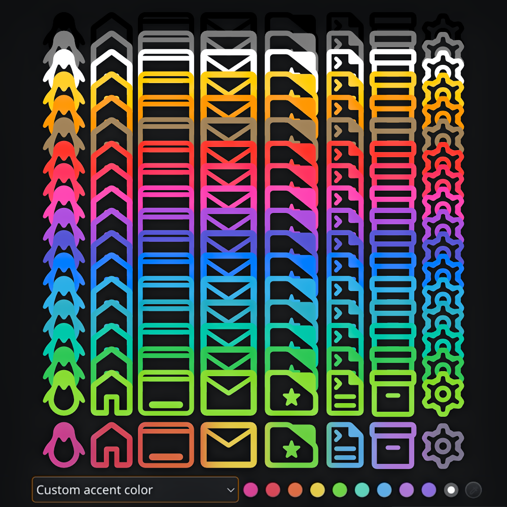
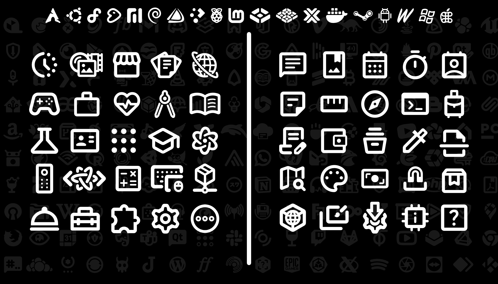

# Cawnonical Mono-Glyph
## Icon Suite

<break>

*The folder set of the Mono Glyph Icon set for the **Cawnsole HTPC project**.*

Mono Glyph Icons - Folder Set is a set of universally understood, visually pleasant, and function first glyph icons.

 

 

This icon suite is a system-wide set of icons based on the Material Design icons from Google, and inspired by Breeze by KDE.

Unlike similar themes, Cawnonical Mono-Glyph Icon Suite brings universally accessible glyph icons to all facets of the Linux desktop.

There are over a thousand newly crafted icons, as well as the entire Google Material icons set, and the entire Google Noto emoji set for extra options. In total this around 10,000 unique glyphs.

### Icon Set Variants

| Folder Set		| Fill Values				| Swatch      |		
|:----------|:----------|:----------|
| accented	| fill="currentColor" 		|  *Accent Color \*Freedesktop Icon Theme spec*
|||
| text-fill	| fill="currentColor" 		|  *Text Color \*Freedesktop Icon Theme spec*
|||
| unfilled	| No fill value defined.	| *Usually displays as black*
|||
| black		| fill="black"				|  ████████████ |
| white		| fill="white"				| ████████████ |
| grey		| fill="grey"				| ████████████ |
| blue		| fill="rgb(0,125,255)"		| ████████████ |
| brown		| fill="rgb(165,135,95)"	| ████████████ |
| cyan		| fill="rgb(50,175,230)"	| ████████████ |
| green		| fill="rgb(55,200,90)"		| ████████████ |
| lime		| fill="rgb(55,200,90)"		| ████████████ |
| indigo	| fill="rgb(90,90,215)"		| ████████████ |
| magenta	| fill="rgb(255,70,180)"	| ████████████ |
| mint		| fill="rgb(0,200,170)"		| ████████████ |
| orange	| fill="rgb(255,150,0)"		| ████████████ |
| pink		| fill="rgb(255,60,100)"	| ████████████ |
| red		| fill="rgb(255,50,50)"		| ████████████ |
| teal		| fill="rgb(50,175,200)"	| ████████████ |
| violet	| fill="rgb(175,85,225)"	| ████████████ |
| yellow	| fill="rgb(255,205,0)"		| ████████████ |
