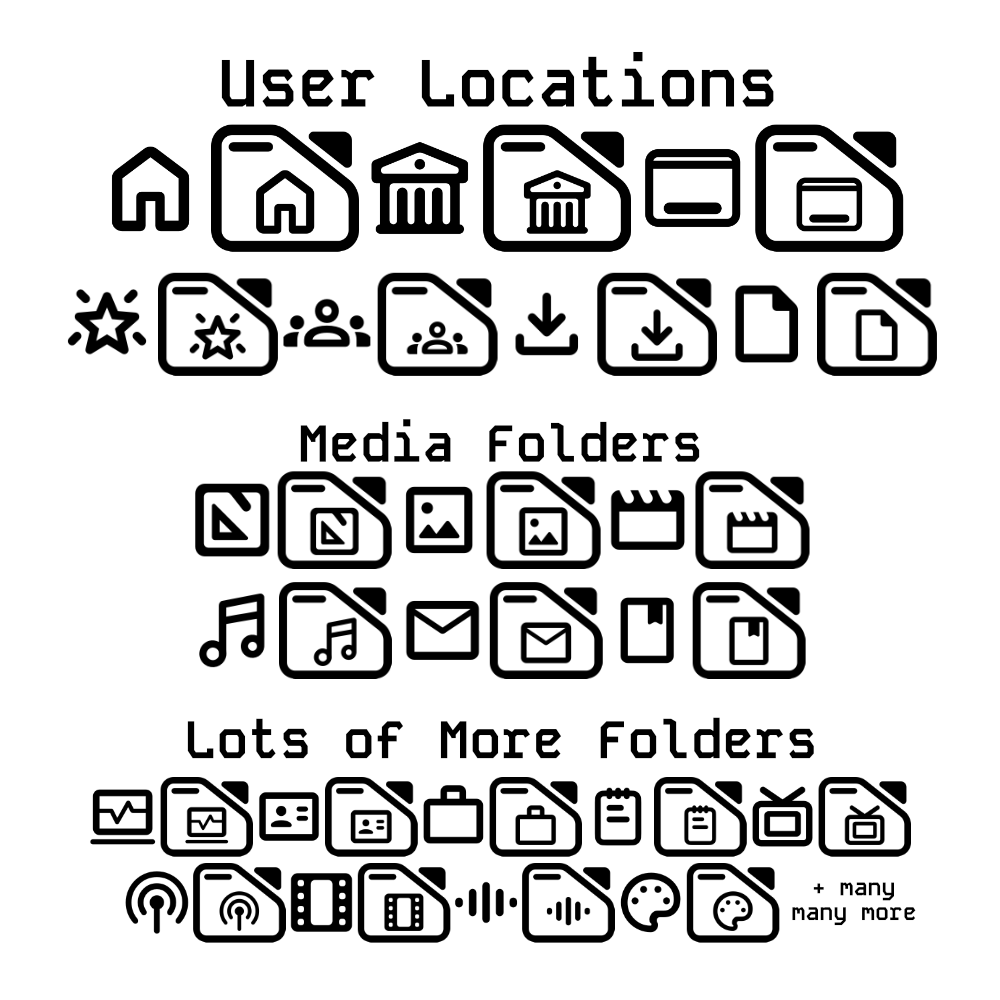
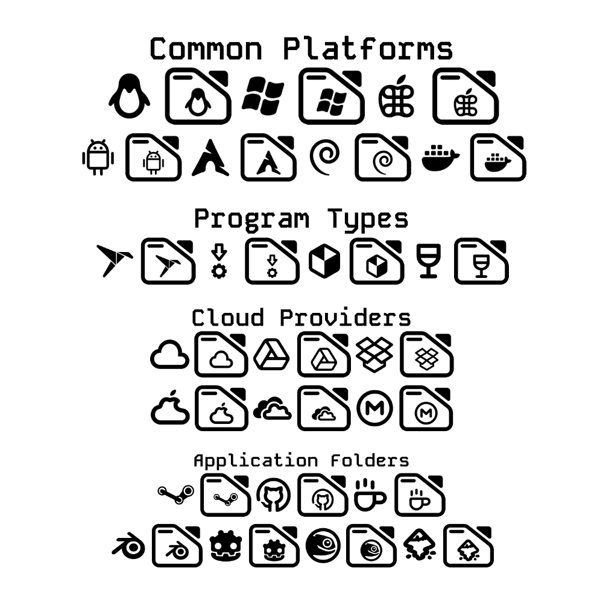
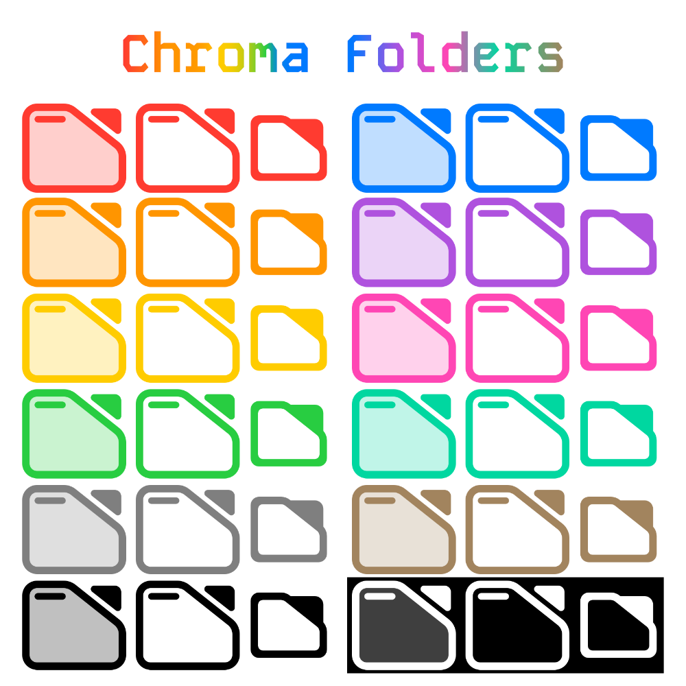
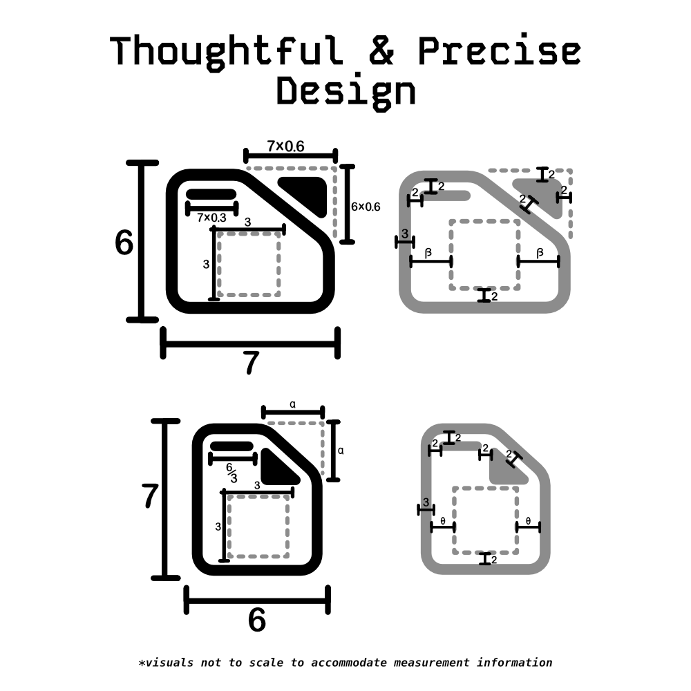
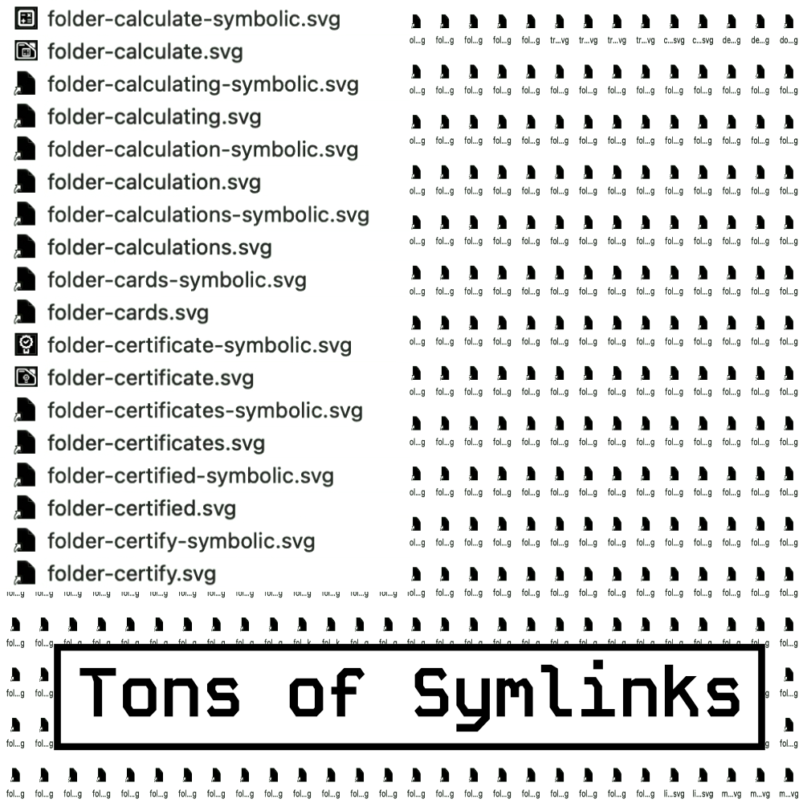

# Cawnsole - Mono Glyph Icons
## Folder Set

<break>

*The folder set of the Mono Glyph Icon set for the **Cawnsole HTPC project**.*

Mono Glyph Icons - Folder Set is a set of universally understood, visually pleasant, and function first folder icons.

  

 

All icons are svg files without defined fill values for individual objects. There are no paths or strokes, only shapes. All colors are defined in the \<svg> headers of each file. Unnecessary metadata has been removed to decrease size.

### Folder Icon Sets with Symlinks

| Folder Set		| Fill Values				| Swatch      |		
|:----------|:----------|:----------|
| folders-accent	| fill="currentColor" 		|  *Accent Color \*Freedesktop Icon Theme spec*
|||
| folders-unfilled	| No fill value defined.	| *Usually displays as black*
|||
| folders-black		| fill="black"				|   |
| folders-white		| fill="white"				|  |
| folders-grey		| fill="grey"				|  |
| folders-blue		| fill="rgb(0,125,255)"		|  |
| folders-brown		| fill="rgb(165,135,95)"	|  |
| folders-cyan		| fill="rgb(50,175,230)"	|  |
| folder-green		| fill="rgb(55,200,90)"		|  |
| folders-indigo	| fill="rgb(90,90,215)"		|  |
| folders-magenta	| fill="rgb(255,70,180)"	|  |
| folders-mint		| fill="rgb(0,200,170)"		|  |
| folders-orange	| fill="rgb(255,150,0)"		|  |
| folders-pink		| fill="rgb(255,60,100)"	|  |
| folders-red		| fill="rgb(255,50,50)"		|  |
| folders-teal		| fill="rgb(50,175,200)"	|  |
| folders-violet	| fill="rgb(175,85,225)"	|  |
| folders-yellow	| fill="rgb(255,205,0)"		|  |

##### *Tons of symlinks for tons of edge cases*

### Folder Icon Sets without Symlinks

| Folder Set		| Fill Values				| Swatch      |		
|:----------|:----------|:----------|
| base-folders	| No fill value defined.	| *Usually displays as black*

